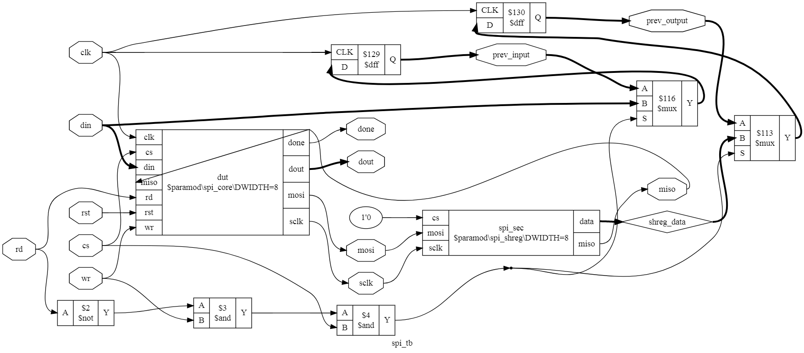

# Formally-Verified SPI Core

This repository implements an SPI core (CPOL=0, CPHA=0) that has been formally verified with respect to a reference design.

## Model/"Spec"
The SPI Core has been verified with respect to a dummy SPI secondary with 8 bit transfers, whose sole purpose is to echo its input.

The following properties have been verified:
* If `done` is asserted, the contents of the secondary's register match the input to the SPI core immediately prior to starting the transfer.
* If `done` is asserted, the output of the SPI core matches the contents of the secondary's register immediately prior to starting the transfer.

The above properties hold for all time under the following conditions:
* The hardware attached to the SPI core never asserts `cs` and `wr` while `done` is asserted.
* The hardware attached to the SPI core never asserts `rd` and `wr` simultaneously.
* The SPI Core and secondary's internal shift registers are initialized assuming an "imaginary previous transfer" completed successfully.

## Limitations
To aid in proving correctness (the main reason for writing this core), the core is very limited in scope. In particular:
* Verilog `initial` statements are used to initialize values (meaning this core only works on FPGA).
* Only CPOL=0, CPHA=0 operation is supported.

## Instructions
To run the formal verification flow, run `make`; the default rule will prepare the Verilog code into an [input format](http://smtlib.cs.uiowa.edu/language.shtml) suitable for SMT solvers, and then run `yosys-smtbmc` a `python3` script which
will annotate the output SMTv2 from the previous step, and then invoke the SMT solver. The SMT solver will then
attempt to prove the assertions in the original Verilog code.

## Prerequisites
* [yosys](https://github.com/cliffordwolf/yosys)
* `python3` for `yosys-smtbmc`
* An SMT solver, I default to [z3](https://github.com/Z3Prover/z3)
